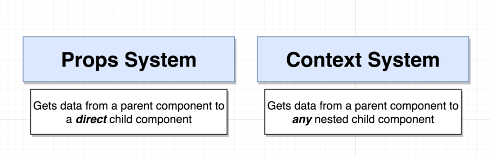
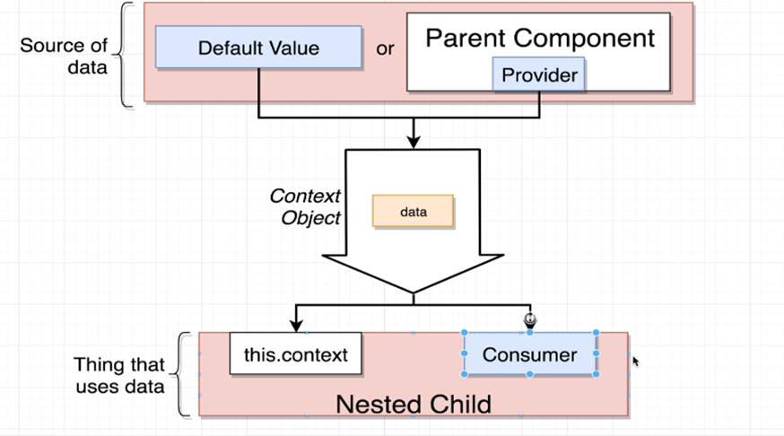
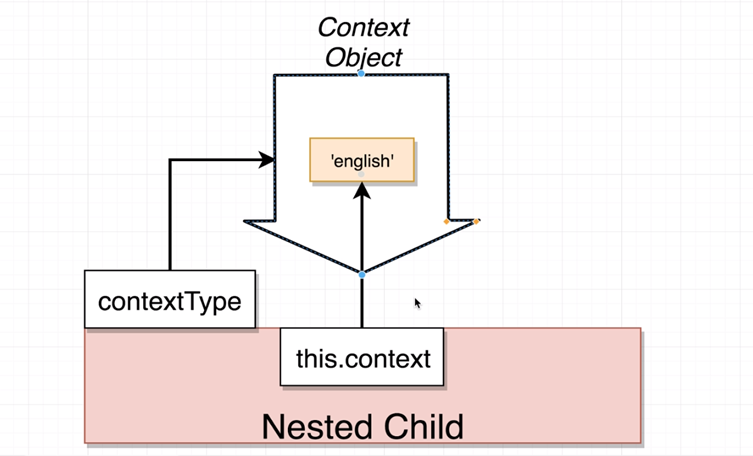
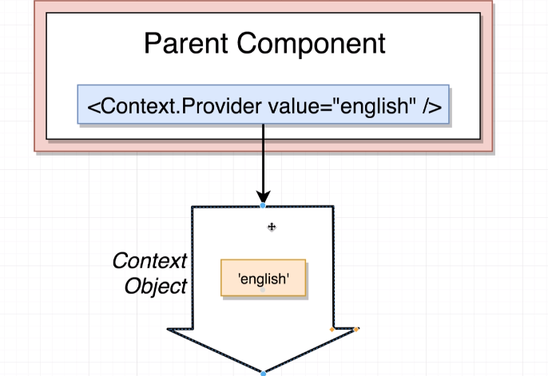

•	With the react context system we can communicate data from a parent to any children component (not necessarily direct child) whereas in prop system the data can only be passed down from parent component to the direct child component

•	Context system at its core is about communicating data. Context Object can be assumed as a pipe where we send down the data from parent component to nested child components.

•	There are two ways of feeding data to context object and two ways of using it in the nested child component

•	context Type property is how we link the context object to the nested child component so we can make use of this.context to access its information 

•	The parent component connects to the context object through the provider component. the data in provided by the provider component via value prop

•	Consumer component is another way to access the data form the context object in nested children components. Consumer component only takes one child and that is callback function (inside curly brackets) where it receives value as the parameter. see button.js

•	Consumer component is used when we want to access multiple context objects in a single component as apposed to this.context method where only on context can be accessed

